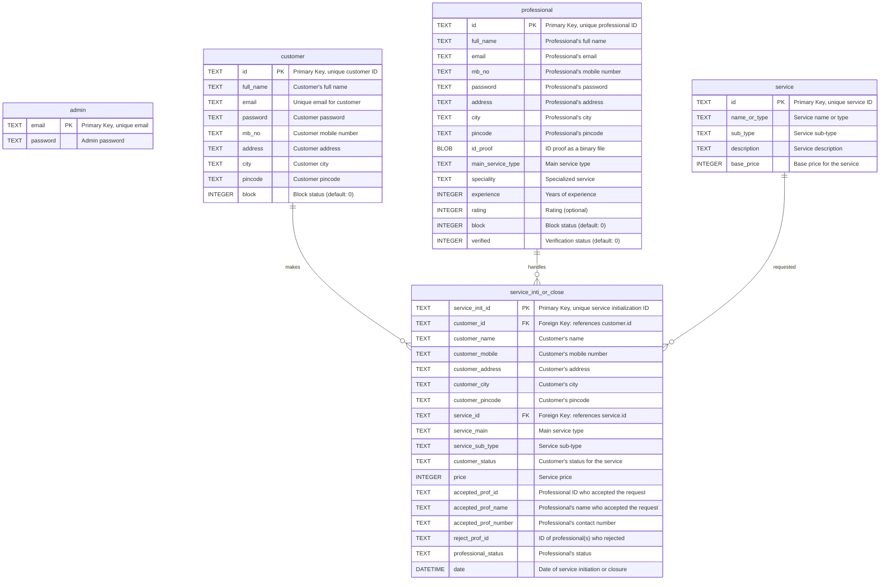

# IITM-Flask-jinja
This is my First Project in Flask framework

## Topic :  A to Z Service Management App

## Description
This project aims to build a Service Management App using knowledge from Modern App Development 1. The app is named **A to Z Service Management App**.

### Technology Used
1. **SQLite – Python (sqlite3 and Flask)**:  
   - SQLite was chosen for binding data to endpoints over SQLAlchemy.
   - Libraries:
     - **sqlite3**: Connects to the SQLite database.
     - **Flask**: A lightweight, open-source Python-based web framework. Includes:
       - `Flask`: Handles HTTP requests (e.g., RESTful APIs like GET, POST, etc.).
       - `render_template`: Renders Jinja2 templates (HTML pages).
       - `request`: Captures data and query parameters from the user side.
       - `redirect`: Redirects the browser to a different URL.
       - `url_for`: Routes to a specific URL by referring to a function name.
       - `send_file`: Sends files (e.g., JPG, PDF) from the server to the client for download.
       - `send_from_directory`: Displays backend files (e.g., JPG, PNG) on the frontend.
2. **Jinja2 and Bootstrap**:
   - Jinja2: For UI templating.
   - Bootstrap: For better CSS and built-in JavaScript functionalities like dropdowns.

---

## Functionalities
1. **Registration**: Separate pages for Customer, Admin, and Professionals.
2. **Login**: Separate login pages for Customer, Admin, and Professionals.
3. **UUID System**: Each user has a unique ID (UUID), and dashboards are accessible only via UUID.
4. **Dashboards**:
   - Three types: Customer, Professional, and Admin.
   - Each dashboard includes features specific to the user role.
5. **Service Management**:
   - Customers can create new service requests and track their status.
   - Professionals can view and accept/reject service requests for services they are registered for (e.g., a hairdresser sees only haircut requests).
6. **Data Flow**:
   - Information is sent from the client side to the backend server.
   - Some data is transmitted via forms, others as parameters.
7. **Admin Features**:
   - Create and price new services.
   - View all information about new service requests.
8. **Search Functionality**:
   - Common for all users (Admin, Customer, Professional) with user-specific search parameters.
9. **Professional Profiles**:
   - Professionals can view their profile and information.
   - Service requests are only visible to verified professionals.

---

